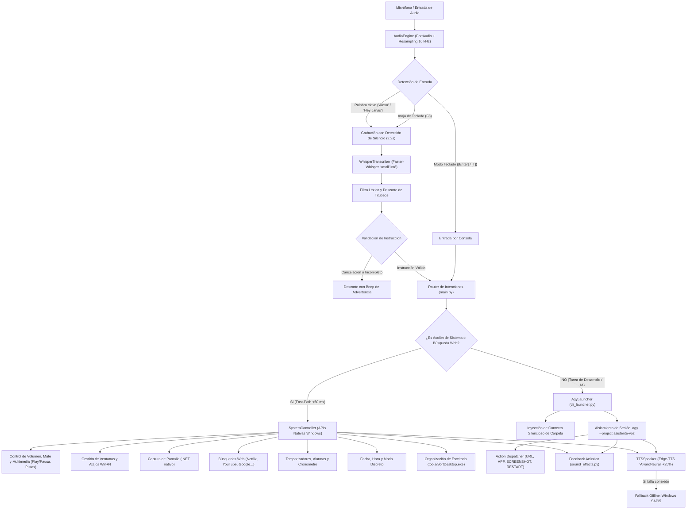

# 🎙️ Antigravity Voice & Text Assistant (Control Híbrido para `agy`)

Asistente virtual por voz y texto conversacional de alta fidelidad para **Antigravity CLI (`agy`)** en sistemas operativos Windows.

Diseñado con una arquitectura modular de **cero configuración**: opera de forma autónoma en entornos Windows 10 u 11 sin requerir dependencias externas del sistema, herramientas propietarias ni configuraciones manuales complejas.

---

## 🏗️ Arquitectura y Flujo de Procesamiento

El sistema implementa un patrón **Hybrid Dual-Track Dispatcher** que separa las acciones inmediatas sobre el sistema operativo de las tareas complejas de desarrollo de software:



---

## 🌟 Características Principales

* **Instalación y Configuración Automatizada (Zero-Config):**
  * Solo requiere contar con Python 3.10 o superior y dispositivos de audio funcionales (micrófono y altavoces/auriculares).
  * El entorno virtual (`venv`) y todas sus dependencias se configuran automáticamente sin requerir ajustes manuales en el sistema.
  * Los modelos de IA (Faster-Whisper y openWakeWord) se descargan e inicializan de forma transparente en su primera ejecución.
  * **Indicador de Carga Realista en Arranque:** Spinner animado en consola que refleja paso a paso la inicialización real de hardware y modelos (audio/micrófono, Faster-Whisper y conexión con Antigravity) antes de dar paso al banner principal.
* **Portabilidad Total y Cero Dependencias de Máquina:**
  * El código y sus utilidades complementarias en `tools/` carecen por completo de rutas absolutas hardcodeadas, nombres de usuario o identificadores locales de máquina.
  * Todas las rutas, carpetas de trabajo y llamadas al sistema se resuelven de manera dinámica (`os.path`, variables de entorno y APIs nativas de Windows), garantizando funcionamiento inmediato y sin cambios en cualquier equipo con Windows 10 o Windows 11.
* **Modo Híbrido (Voz + Teclado en la Misma Terminal):**
  * **Voz Manos Libres:** Actívalo diciendo la palabra de activación configurada (*"Alexa"* por defecto, o *"Hey Jarvis"*) o presionando la tecla de atajo **`F8`**.
  * **Modo Escritura Inmediato:** Pulsa **`[Enter]`** o la tecla **`[T]`** en la consola: el micrófono se pausa temporalmente para permitir tipear o pegar comandos extensos sin interferencias acústicas.
* **Control de Repositorio y Carpeta de Trabajo Activa:**
  * El asistente mantiene noción exacta de en qué carpeta debe operar.
  * Cambia de proyecto en cualquier instante desde el modo teclado escribiendo:
    * `/c C:\ruta\a\tu\proyecto` o `/cd C:\ruta\a\tu\proyecto` (también alias como `cd ..`, `/folder <ruta>`), o por voz (*"cambiar carpeta a..."*).
  * Todas las acciones de código, consultas de archivos y comandos de terminal de Antigravity se ejecutarán dentro de esa carpeta.
* **Gestión Inteligente de Memoria y Aislamiento de Sesión:**
  * **Memoria por Sesión Efímera (`SESSION_MEMORY_MODE = "per_session"`):** Cada vez que se abre el asistente, arranca con una conversación limpia de cero, eliminando latencia acumulada y previniendo la contaminación de contexto o saturación de tokens. Dentro de una misma sesión mantiene el hilo conversacional continuo.
  * **Aislamiento de Proyecto (`AGY_PROJECT_ID = "asistente-voz"`):** Todas las consultas a la IA se canalizan bajo un identificador de proyecto exclusivo (`--project`), garantizando que el asistente nunca mezcle su contexto ni colisione con sesiones interactivas manuales de Antigravity CLI abiertas en otras terminales.
  * **Sincronización Unificada de Actividad (Blackboard / Shared Context Buffer):** Las acciones ejecutadas por la vía rápida del sistema (capturas de pantalla con su ruta de guardado, ajustes de volumen, cambio de carpeta de trabajo o búsquedas) se registran en un buffer cronológico en memoria. Al consultar a la IA, este historial reciente se inyecta automáticamente en su contexto silencioso, permitiéndole saber qué se hizo en la máquina (*"¿dónde se guardó la captura?"*, *"¿qué fue lo último que te pedí?"*).
  * **Reseteo en Caliente:** Permite limpiar la memoria en cualquier momento sin reiniciar la app, ya sea por voz (*"nueva sesión"*, *"olvidá lo anterior"*, *"reiniciar memoria"*) o por teclado (`/new`, `/reset`, `/clear`). Al cambiar de carpeta con `/cd`, la memoria se renueva automáticamente.
* **Transparencia de Modelo y Nivel de Razonamiento Activo:**
  * **Detección Dinámica de Configuración:** Detecta de forma transparente el modelo de lenguaje y el nivel de razonamiento configurados en Antigravity CLI (inspeccionando el archivo de preferencias globales en `%USERPROFILE%\.gemini\antigravity-cli\settings.json`, o respetando `AGY_MODEL` y `AGY_REASONING_EFFORT` si se definen explícitamente en `config.py`).
  * **Presentación en el Banner de Inicio:** Informa claramente al usuario desde la pantalla de bienvenida qué modelo y qué nivel de razonamiento están activos (ej. `Gemini 3.8 Flash` con esfuerzo `Alto (High)`).
  * **Estabilidad y Ejecución Predecible:** El asistente ejecuta `agy` utilizando la configuración activa del entorno sin aplicar heurísticas dinámicas artificiales sobre los prompts ni depender de palabras clave, garantizando máxima fidelidad y estabilidad tanto para tareas del propio asistente como para repositorios y proyectos externos.
* **Telemetría y Registro Temporal de Interacciones:**
  * **Estampas de Tiempo en Consola:** Cada instrucción ingresada (tanto por voz como por teclado) se imprime registrando la hora exacta (`[HH:MM:SS]`).
  * **Auditoría de Latencia en Panel de Respuesta:** El panel de respuesta de Antigravity CLI exhibe en su cabecera el horario de recepción y en el subtítulo la duración total en segundos (`Duración: X.Xs`), permitiendo evaluar y depurar tiempos de respuesta de forma limpia y directa.
* **Reinicio Automático Supervisado:**
  * Permite recargar el asistente completo en ~1 segundo para aplicar cambios de código o configuración, liberando de forma limpia todos los recursos de bajo nivel (micrófono, hooks de teclado y modelos).
  * Se activa mediante voz (*"reiniciate"*, *"reiniciar asistente"*), por teclado (`/restart`, `/reiniciar`) o de forma autónoma por la IA (`[ACTION: RESTART]`) tras editar archivos del propio asistente.
  * Implementa un patrón supervisor mediante código de salida acordado (`42`) soportado tanto en `iniciar_asistente.bat` como en la ejecución directa de `main.py`.
* **Arquitectura Híbrida de Doble Vía con Despachador de Acciones:**
  * **Vía Rápida Local (<50 ms):** Reconoce de forma instantánea acciones mecánicas deterministas sobre el sistema operativo: control de volumen y mute, capturas de pantalla, ordenar escritorio, minimizar ventanas, atajos de barra de tareas, temporizadores, cronómetro, fecha/hora, modo discreto, búsquedas directas y reinicio del asistente. Incluye soporte de **repetición contextual inmediata** (*"otra"*, *"sacá otra"*, *"hacé otra"*, *"otra captura"*) para repetir la última acción sin latencia. Los patrones están rigurosamente anclados al inicio de la orden imperativa e incorporan filtro de cláusulas explicativas (*"noto que..."*, *"cuando te pido..."*, *"por ejemplo..."*), evitando falsos positivos cuando el usuario reflexiona o conversa.
  * **Vía Inteligente (Antigravity CLI + Action Dispatcher):** Las consultas con criterios semánticos, comparativos o superlativos (*"el video más visto de..."*, *"el mejor tutorial..."*, análisis de código, control de versiones Git, etc.) son derivadas a la IA con timeout extendido (`AGY_PRINT_TIMEOUT = "20m"`). Además, dispone de un despachador de directivas de escritorio: apertura web (`[ACTION: OPEN_URL <url>]`), lanzamiento de aplicaciones (`[ACTION: OPEN_APP <app>]`), capturas (`[ACTION: SCREENSHOT]`) y reinicio supervisado (`[ACTION: RESTART]`).
* **Visión y Lectura Óptica en Caliente (OCR Nativo Windows + Escalamiento Progresivo):**
  * **Enfoque en Ventana Activa (Active Window Focus):** Detecta instantáneamente mediante Win32 API (`user32.dll`) cuál es la aplicación en foco y su título (ej. *"Visual Studio Code"*, *"PowerShell"*), capturando únicamente sus límites visuales e ignorando la barra de tareas, bandejas del sistema y ventanas de fondo.
  * **Nivel 1 - OCR en Memoria Nativo de Windows (0 MB de descarga, 0 GPU):** Ejecuta el motor nativo `Windows.Media.Ocr.OcrEngine` (WinRT) directamente en memoria sin escribir archivos en disco. Extrae texto, trazas de excepción, logs de compilación o código fuente en ~200 ms, inyectándolo como texto plano en el prompt con una economía radical de tokens (ahorro del 80-90% frente a modelos de visión).
  * **Nivel 2 - Escalamiento Progresivo a Visión Multimodal:** Si el OCR arroja información insuficiente (gráficos estadísticos, diagramas, esquemas en Figma, lienzos vacíos o imágenes sin texto) o el usuario formula una consulta con intención visual o de evaluación explícita (*"analizá este gráfico"*, *"diseño"*, *"colores"*, *"maqueta"*, *"cuál es tu opinión de esto"*, *"qué opinás de esto"*), el sistema escala automáticamente generando una captura temporal en `screenshots/temp_inspect_*.png` para que la IA la procese con visión multimodal.
  * **Limpieza Efímera Garantizada:** La captura temporal se elimina de forma inmediata y automática (`try...finally`) al concluir la respuesta, asegurando cero basura residual en el disco.
* **Respuesta por Voz Selectiva y Completa (TTS):**
  * **Vocalización Completa para Respuestas Relevantes:** Para preguntas, explicaciones de código, razonamiento y consultas informativas, el sintetizador pronuncia la respuesta completa de manera natural, sin cortes artificiales ni frases de truncamiento.
  * **Silencio en Acciones Mecánicas:** Para tareas de ejecución directa (búsquedas en Disney Plus, YouTube o Google, apertura de aplicaciones, cambios de volumen, capturas de pantalla, atajos o minimizado de ventanas), el asistente no emite parloteo innecesario por los altavoces; confirma la acción de forma no invasiva mediante el panel en consola y el sonido acústico (chime).
  * Voz neuronal en español (`es-ES-AlvaroNeural`) con velocidad ajustada al **+25%** para una dicción ágil y natural.
  * Filtro automático de Markdown que limpia bloques de código y enlaces para evitar lecturas tediosas al oído.
  * Fallback nativo: si no hay conexión a internet para el servicio neuronal, conmuta automáticamente al sintetizador local de Windows (SAPI5).
* **Transcripción Robusta con Filtro de Titubeos:**
  * Motor **Faster-Whisper** (`small` con cómputo int8) de alta precisión en español sobre CPU.
  * Módulo de validación que elimina muletillas iniciales (*eh*, *este*, *bueno*), corrige errores fonéticos (*"hola mundos"* ➜ *"hola mundo"*, *"mi dudev"* ➜ *"midudev"*) y descarta titubeos o cancelaciones voluntarias (*"no nada"*, *"cancela"*).
  * Tolerancia a pausas naturales (2.2 segundos de silencio antes de cerrar la grabación), permitiendo pensar mientras se habla.
* **Detección Automática y Calibración de Micrófono:**
  * Escanea y selecciona automáticamente la mejor interfaz de audio disponible (probando WASAPI, DirectSound y WDM-KS para evitar incompatibilidades de host MME en Windows).
  * Remuestreo dinámico a 16 kHz y normalización de picos a 0.9 para capturar tanto micrófonos de escritorio como arreglos integrados en laptops.
* **Feedback Acústico no Invasivo:**
  * Beeps nativos (`winsound`) que indican activación, fin de grabación y confirmación de comandos sin saturar la consola.

---

## 📁 Estructura del Proyecto

* **`main.py`**: Punto de entrada del programa. Administra el bucle principal de eventos, el escucha global de teclado (`pynput`), la captura de pulsaciones no bloqueantes en Windows (`msvcrt`), la orquestación del Fast-Path y el renderizado de la interfaz en terminal con `rich`.
* **`audio_engine.py`**: Motor de captura de audio con PortAudio (`sounddevice`). Realiza auto-detección de micrófono, remuestreo dinámico a 16 kHz vía `scipy.signal`, calibración de ruido ambiental y detección de palabra de activación con `openwakeword`.
* **`transcriber.py`**: Transcripción de voz a texto con `faster-whisper`. Implementa limpieza de patrones léxicos, descarte de muletillas, corrección fonética y validación de órdenes.
* **`screen_reader.py`**: Motor de captura de ventana activa, OCR en memoria nativo de Windows (`Windows.Media.Ocr`) y enrutamiento inteligente de escalamiento progresivo (texto vs visión multimodal).
* **`cli_launcher.py`**: Integración con el ejecutable `agy`. Inyecta directivas de contexto silenciosas, análisis de pantalla en caliente, ejecuta el subproceso en la carpeta de trabajo activa, procesa directivas de apertura en el escritorio interactivo (`[ACTION: OPEN_URL/OPEN_APP/SCREENSHOT/RESTART]`) y coordina la síntesis de audio de la respuesta limpia.
* **`system_controller.py`**: Controlador nativo del sistema operativo (Fast-Path). Ejecuta instantáneamente (<50 ms) acciones mecánicas de Windows (volumen, ventanas, capturas, búsquedas, alarmas, cronómetro y reinicio), discriminando consultas literales de aquellas que requieren razonamiento semántico para delegarlas a la IA.
* **`tts_speaker.py`**: Módulo de síntesis de voz (Text-to-Speech) con `edge-tts`, reproducción de audio con `pygame.mixer` y fallback offline a Windows SAPI5 (`System.Speech`).
* **`sound_effects.py`**: Señalización acústica no bloqueante con `winsound.Beep`.
* **`config.py`**: Parámetros globales y ajustables del sistema (palabras clave, atajos, modelos, voz, velocidad, silencios, umbrales de OCR).
* **`iniciar_asistente.bat`**: Script de arranque para Windows. Detecta el ejecutable de Python disponible (`py -3` o `python`), genera el entorno virtual, instala dependencias y lanza el asistente manteniendo la consola visible ante cualquier error.
* **`requirements.txt`**: Lista de dependencias del ecosistema Python necesarias para el proyecto.
* **`tools/`**: Directorio de herramientas y binarios complementarios para interactuar con APIs del sistema operativo (contiene `SortDesktop.exe` para organizar los elementos del escritorio vía Windows Shell COM).
* **`.gitignore`**: Exclusión de archivos binarios, cachés de modelos y entornos virtuales locales.
* **`AGENTS.md`**: Guía y normas arquitectónicas para agentes de desarrollo.


---

## 🚀 Instalación y Puesta en Marcha

### Requisitos Previos
1. Sistema operativo **Windows 10** o **Windows 11** (64 bits).
2. **Python 3.10** o superior instalado en el sistema.
   * *Si se instala desde [python.org/downloads](https://www.python.org/downloads/): marcar la casilla **"Add python.exe to PATH"** en el instalador.*
3. Micrófono y altavoces / auriculares funcionales.
4. **Antigravity CLI (`agy`)** instalado y disponible en la terminal.

---

### Opción A: Inicio Automático en 1 Clic (Recomendado)

1. **Obtener el proyecto:**
   * Clonar el repositorio o descargar el código fuente y situarse en la carpeta raíz del proyecto:
     ```bash
     git clone <URL_DEL_REPOSITORIO>
     cd asistente-virtual-ia
     ```
2. **Ejecutar el lanzador:**
   * Hacer doble clic sobre el archivo **`iniciar_asistente.bat`** (o ejecutarlo desde PowerShell / CMD).
3. **¿Qué realiza automáticamente este script?**
   * Detecta la instalación de Python disponible en Windows (`py -3` o `python`).
   * Crea un entorno virtual aislado en la carpeta `venv` (sin alterar librerías globales del sistema).
   * Instala las dependencias desde `requirements.txt` (~400 MB en paquetes compilados) y genera un marcador centinela (`venv\.installed`) al completar con éxito.
   * En el primer arranque, descarga los modelos de IA necesarios (Faster-Whisper `small` ~460 MB desde HuggingFace y modelos openWakeWord).
   * **Duración y volumen inicial:** La primera puesta en marcha descarga aproximadamente **~900 MB a 1 GB** en total entre librerías y modelos neuronales, lo que toma habitualmente entre 3 y 10 minutos según la velocidad de conexión.
   * **Ejecución continua:** `iniciar_asistente.bat` no es un instalador que se cierra al terminar; una vez calibrado el micrófono, el asistente queda **activo y en ejecución permanente** escuchando órdenes por voz o teclado (`while True:`).
   * Para forzar una reinstalación limpia si hubo un corte de energía o error en el disco, se puede ejecutar `iniciar_asistente.bat --clean` o borrar manualmente la carpeta `venv`.

---

### Opción B: Instalación Manual por Consola (Paso a Paso)

Si prefieres realizar el procedimiento manualmente desde PowerShell o CMD:

```powershell
# 1. Ingresar a la carpeta del proyecto
cd asistente-virtual-ia

# 2. Crear el entorno virtual
python -m venv venv

# 3. Activar el entorno virtual
.\venv\Scripts\activate

# 4. Actualizar pip e instalar dependencias
python -m pip install --upgrade pip
pip install -r requirements.txt

# 5. Iniciar el asistente
python main.py
```

---

### 💡 Diagnóstico y Manejo de Errores en Consola

Todos los errores y advertencias se muestran directamente en la ventana de la consola (CMD/PowerShell) con formato visual y código de colores:

* **Ventana Persistente ante Errores:**
  * El archivo `iniciar_asistente.bat` finaliza con la directiva `pause`. Si ocurre un fallo en Python o en la instalación, la ventana no se cierra abruptamente, permitiendo leer la traza completa (*traceback*) y diagnosticar el problema.
* **Instalación interrumpida o entorno corrupto:**
  * Si la consola se cerró forzadamente mientras descargaba paquetes, el script detecta la ausencia del centinela `venv\.installed`, muestra una advertencia y reanuda automáticamente la instalación de las dependencias faltantes sin dejar el entorno a medio armar.
* **Consola "congelada" por QuickEdit (Modo Selección en Windows):**
  * Si haces clic con el cursor dentro de la ventana de CMD de Windows, el sistema entra en modo selección de texto (muestra *"Seleccionar"* en la barra de título) y suspende la ejecución de Python en segundo plano. Si parece detenido sin avanzar, pulsa **`Enter`** o **`Esc`** para reanudar el flujo.
* **"No se encontró una instalación funcional de Python":**
  * Descarga e instala Python 3.10+ desde la web oficial. Si ya lo tienes instalado pero no lo reconoce, reinstálalo seleccionando la opción *"Modify"* y tildando *"Add Python to environment variables"*.
* **Permisos del micrófono en Windows:**
  * Si el asistente no detecta audio, verifica en *Configuración de Windows ➜ Privacidad y seguridad ➜ Micrófono* que estén activadas las opciones *"Permitir que las aplicaciones accedan al micrófono"* y *"Permitir que las aplicaciones de escritorio accedan al micrófono"*.
* **"No se encontró el comando 'agy' en el PATH":**
  * Si Antigravity CLI no está configurado en las variables de entorno del sistema, el asistente notificará la situación en consola y por audio sin interrumpir la ejecución. Una vez que `agy` esté disponible en la terminal, los comandos se despacharán con normalidad.

---

## 🎮 Formas de Interacción y Comandos Soportados

Una vez abierto el asistente, puedes interactuar tanto por voz como por teclado:

| Categoría | Ejemplo por Voz o Texto | Acción Ejecutada |
| :--- | :--- | :--- |
| **Voz Manos Libres** | *"Alexa, qué cambios hay en este git?"* | Graba con detección automática de silencio y ejecuta con IA. |
| **Atajo Push-to-Talk** | Presionar **`F8`** y hablar | Inicia o detiene la grabación manualmente con una sola tecla. |
| **Modo Teclado** | Pulsar **`[Enter]`** o **`[T]`** | Pausa el micrófono para tipear instrucciones o pegar rutas largas. |
| **Cambiar Repositorio** | `/c <ruta>`, `/cd <ruta>` o por voz | Redirige la carpeta activa donde opera Antigravity CLI (renueva memoria). |
| **Reiniciar Memoria** | *"Nueva sesión"* / *"Olvidá lo anterior"* / `/new` | Resetea la memoria conversacional en caliente sin cerrar la app. |
| **Lectura de Pantalla e IA** | *"Mirá la pantalla y decime qué falló"* / *"Fijate este error"* | Extrae el texto de la ventana activa vía OCR nativo o escala a visión multimodal. |
| **Copiar Texto de Pantalla** | *"Copiar texto de la pantalla"* / *"Copiar pantalla"* | Realiza OCR ultrarrápido en memoria y copia el texto al portapapeles de Windows (`clip`). |
| **Búsqueda Web Rápida** | *"Abrí Netflix y buscá El diablo viste a la moda"* / *"Busca Avengers en Disney Plus"* | Abre la búsqueda en el navegador predeterminado en <50 ms sin parloteo de voz. |
| **Búsqueda en Sitios y Videos** | *"Busca trailer de Matrix en YouTube"* / *"Busca en YouTube el trailer de Matrix"* / *"Buscame el video de Midudev"* | Abre la búsqueda directa en YouTube, Google, Disney Plus, GitHub, etc. en <50 ms. |
| **Captura de Pantalla** | *"Sacá una captura de pantalla"* | Captura el escritorio completo y lo guarda en `screenshots/captura_*.png`. |
| **Captura de Ventana** | *"Sacá una captura de ventana"* / *"Captura de esta ventana"* | Captura únicamente los límites de la ventana activa en `screenshots/captura_ventana_*.png`. |
| **Repetición Contextual** | *"Otra"* / *"Sacá otra"* / *"Hacé otra"* / *"Otra más"* | Repite de inmediato la última acción mecánica ejecutada (captura, ventana o volumen). |
| **Control de Volumen** | *"Subí el volumen"* / *"Volumen al 30"* / *"Mute"* | Ajusta o silencia el mezclador de sonido de Windows. |
| **Control de Ventanas** | *"Minimizar todo"* / *"Cerrar ventana"* | Minimiza el escritorio (`Win+D`) o cierra la app activa (`Alt+F4`). |
| **Atajo de Barra de Tareas** | *"Atajo 1"* (hasta *"Atajo 9"*) | Lanza el programa fijado en la posición N de la barra de tareas. |
| **Hora y Fecha** | *"¿Qué hora es?"* / *"¿Qué fecha es hoy?"* | Responde al instante con la hora y fecha del sistema. |
| **Alarmas y Temporizadores**| *"Alarma en 5 minutos"* / *"Temporizador de 10 minutos"* | Programa una alerta audible y aviso por voz en segundo plano. |
| **Cronómetro** | *"Iniciá cronómetro"* / *"Tiempo del cronómetro"* | Controla el cronómetro interno y te informa el tiempo transcurrido. |
| **Modo Discreto** | *"Modo discreto"* / *"Activar voz"* | Silencia las respuestas de audio o vuelve a activar el habla TTS. |
| **Reiniciar Asistente** | *"Reiniciate"* / *"Reiniciar asistente"* / `/restart` | Recarga el proceso completo en ~1s aplicando cambios de código y liberando hardware. |
| **Apagar Asistente** | *"Basta"* / *"Cerrar asistente"* / *"Apágate"* | Finaliza la ejecución del programa de forma ordenada. |
| **Desarrollo y Razonamiento**| *"Creá un script para ordenar archivos por fecha"* | Despacha la tarea a Antigravity CLI con herramientas y archivos. |

---

## ⚙️ Opciones de Configuración (`config.py`)

Todos los parámetros del sistema se centralizan en [`config.py`](config.py):

| Variable | Valor por Defecto | Descripción |
| :--- | :--- | :--- |
| `WAKE_WORDS` | `["alexa"]` | Lista de palabras de activación reconocidas por openWakeWord. |
| `WAKE_WORD_THRESHOLD` | `0.5` | Umbral de sensibilidad para la detección de la palabra clave. |
| `HOTKEY_PUSH_TO_TALK` | `"f8"` | Tecla global para alternar la grabación (`"f8"`, `"f9"`, `"<ctrl>+<space>"`). |
| `SAMPLE_RATE` | `16000` | Frecuencia de muestreo estándar requerida por Whisper y openWakeWord. |
| `SILENCE_DURATION` | `2.2` | Segundos continuos de silencio para determinar el fin de la instrucción. |
| `MIN_RECORD_SECONDS` | `1.5` | Duración mínima obligatoria para evitar cortes prematuros. |
| `MAX_RECORD_SECONDS` | `300.0` | Límite máximo de seguridad (5 minutos); la grabación finaliza al detectar silencio. |
| `WHISPER_MODEL_SIZE` | `"small"` | Tamaño del modelo de Faster-Whisper (`tiny`, `base`, `small`, `medium`). |
| `WHISPER_LANGUAGE` | `"es"` | Idioma forzado para transcripción precisa en español. |
| `WHISPER_DEVICE` | `"cpu"` | Dispositivo de cómputo para inferencia (`cpu` o `cuda`). |
| `WHISPER_COMPUTE_TYPE` | `"int8"` | Cuantización int8 para inferencia ultrarrápida en procesadores estándar. |
| `SCREEN_OCR_MIN_CHARS` | `30` | Mínimo de caracteres legibles en OCR antes de escalar automáticamente a visión multimodal. |
| `TTS_ENABLED` | `True` | Habilita o deshabilita la síntesis de voz de salida. |
| `TTS_VOICE` | `"es-ES-AlvaroNeural"` | Voz neuronal en español (`AlvaroNeural`, `ElviraNeural`, `JorgeNeural`, `TomasNeural`). |
| `TTS_RATE` | `"+25%"` | Ajuste porcentual de la velocidad del habla para mayor agilidad. |
| `SOUND_FEEDBACK_ENABLED`| `True` | Emisión de beeps acústicos no bloqueantes para confirmar estados. |
| `DEFAULT_PROJECT_DIR` | `None` | Carpeta de trabajo inicial fija (`None` adopta el directorio de ejecución). |
| `SESSION_MEMORY_MODE` | `"per_session"` | Modo de memoria: `"per_session"` (limpia al abrir), `"persistent"` o `"stateless"`. |
| `AGY_PROJECT_ID` | `"asistente-voz"` | Identificador de proyecto exclusivo para aislar el asistente de otras consolas. |
| `AGY_PRINT_TIMEOUT` | `"20m"` | Límite de espera de ejecución para tareas complejas de desarrollo en Antigravity CLI. |
| `AGY_MODEL` | `None` | Modelo de lenguaje para la sesión de `agy` (`None` detecta dinámicamente el configurado en Antigravity). |
| `AGY_REASONING_EFFORT` | `None` | Nivel de razonamiento fijo manual (`None`, `"low"`, `"medium"`, `"high"`). |

