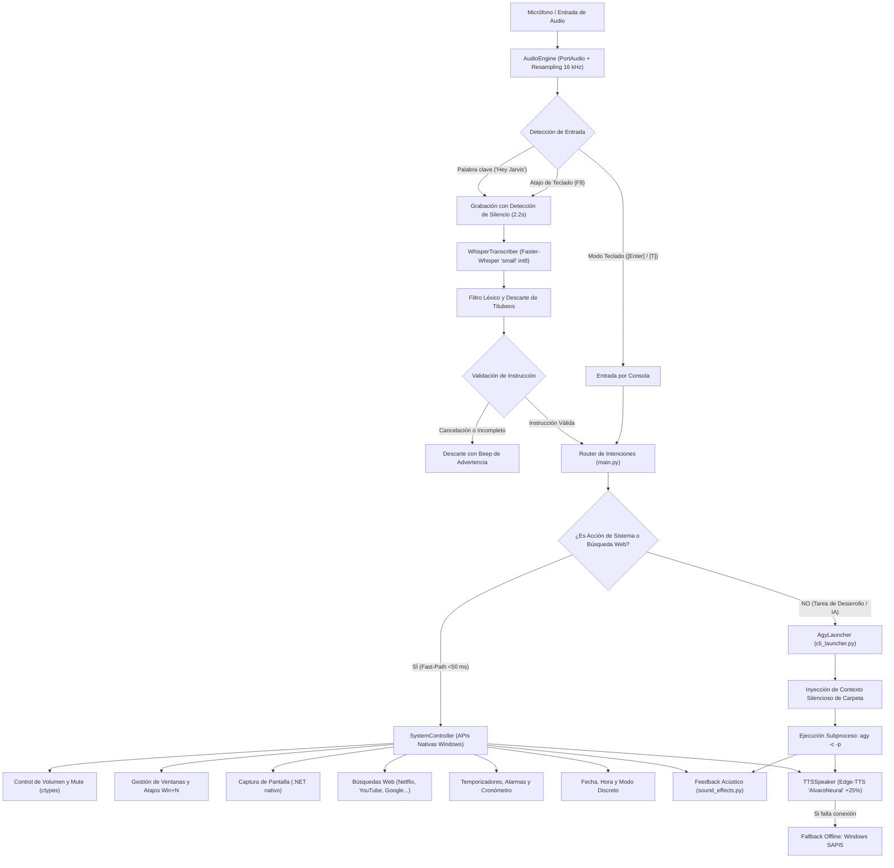

# 🎙️ Antigravity Voice & Text Assistant (Control Híbrido para `agy`)

Asistente virtual por voz y texto conversacional de alta fidelidad para **Antigravity CLI (`agy`)** en sistemas operativos Windows.

Diseñado con una arquitectura modular de **cero configuración**: opera de forma autónoma en entornos Windows 10 u 11 sin requerir dependencias externas del sistema, herramientas propietarias ni configuraciones manuales complejas.

---

## 🏗️ Arquitectura y Flujo de Procesamiento

El sistema implementa un patrón **Hybrid Dual-Track Dispatcher** que separa las acciones inmediatas sobre el sistema operativo de las tareas complejas de desarrollo de software:



---

## 🌟 Características Principales

* **Instalación y Configuración Automatizada (Zero-Config):**
  * Solo requiere contar con Python 3.10 o superior y dispositivos de audio funcionales (micrófono y altavoces/auriculares).
  * El entorno virtual (`venv`) y todas sus dependencias se configuran automáticamente sin requerir ajustes manuales en el sistema.
  * Los modelos de IA (Faster-Whisper y openWakeWord) se descargan e inicializan de forma transparente en su primera ejecución.
* **Modo Híbrido (Voz + Teclado en la Misma Terminal):**
  * **Voz Manos Libres:** Actívalo diciendo *"Hey Jarvis"* o presionando la tecla de atajo **`F8`**.
  * **Modo Escritura Inmediato:** Pulsa **`[Enter]`** o la tecla **`[T]`** en la consola: el micrófono se pausa temporalmente para permitir tipear o pegar comandos extensos sin interferencias acústicas.
* **Control de Repositorio y Carpeta de Trabajo Activa:**
  * El asistente mantiene noción exacta de en qué carpeta debe operar.
  * Cambia de proyecto en cualquier instante desde el modo teclado escribiendo:
    * `/cd C:\ruta\a\tu\proyecto` (o comandos estándar como `cd ..`, `/folder <ruta>`).
  * Todas las acciones de código, consultas de archivos y comandos de terminal de Antigravity se ejecutarán dentro de esa carpeta.
* **Arquitectura Híbrida de Doble Vía (Fast-Path Nativo + Deep AI):**
  * **Vía Rápida Local (<50 ms):** Reconoce de forma instantánea acciones sobre el sistema operativo (control de volumen, silenciar, capturas de pantalla, minimizar ventanas, atajos de barra de tareas, temporizadores, cronómetro, fecha/hora, modo discreto y búsquedas directas en YouTube, Netflix, Google, Mercado Libre, etc.) ejecutándolas inmediatamente sin requerir llamadas lentas ni gastar tokens de red.
  * **Vía Inteligente (Antigravity CLI):** Cualquier consulta de desarrollo de software, análisis de código, control de versiones Git, refactorizaciones o preguntas de programación complejas es delegada a la IA con contexto completo de archivos y herramientas de terminal.
* **Respuesta por Voz Ágil y Natural (TTS):**
  * Voz neuronal en español (`es-ES-AlvaroNeural`) con velocidad ajustada al **+25%** para una respuesta dinámica y natural.
  * Filtro automático de Markdown que limpia bloques de código y enlaces para evitar lecturas tediosas al oído.
  * Fallback nativo: si no hay conexión a internet para el servicio neuronal, conmuta automáticamente al sintetizador local de Windows (SAPI5).
* **Transcripción Robusta con Filtro de Titubeos:**
  * Motor **Faster-Whisper** (`small` con cómputo int8) de alta precisión en español sobre CPU.
  * Módulo de validación que elimina muletillas iniciales (*eh*, *este*, *bueno*), corrige errores fonéticos (*"hola mundos"* ➜ *"hola mundo"*) y descarta titubeos o cancelaciones voluntarias (*"no nada"*, *"cancela"*).
  * Tolerancia a pausas naturales (2.2 segundos de silencio antes de cerrar la grabación), permitiendo pensar mientras se habla.
* **Detección Automática y Calibración de Micrófono:**
  * Escanea y selecciona automáticamente la mejor interfaz de audio disponible (probando WASAPI, DirectSound y WDM-KS para evitar incompatibilidades de host MME en Windows).
  * Remuestreo dinámico a 16 kHz y normalización de picos a 0.9 para capturar tanto micrófonos de escritorio como arreglos integrados en laptops.
* **Feedback Acústico no Invasivo:**
  * Beeps nativos (`winsound`) que indican activación, fin de grabación y confirmación de comandos sin saturar la consola.

---

## 📁 Estructura del Proyecto

* **`main.py`**: Punto de entrada del programa. Administra el bucle principal de eventos, el escucha global de teclado (`pynput`), la captura de pulsaciones no bloqueantes en Windows (`msvcrt`), la orquestación del Fast-Path y el renderizado de la interfaz en terminal con `rich`.
* **`audio_engine.py`**: Motor de captura de audio con PortAudio (`sounddevice`). Realiza auto-detección de micrófono, remuestreo dinámico a 16 kHz vía `scipy.signal`, calibración de ruido ambiental y detección de palabra de activación con `openwakeword`.
* **`transcriber.py`**: Transcripción de voz a texto con `faster-whisper`. Implementa limpieza de patrones léxicos, descarte de muletillas, corrección fonética y validación de órdenes.
* **`cli_launcher.py`**: Integración con el ejecutable `agy`. Inyecta directivas de contexto silenciosas, ejecuta el subproceso en la carpeta de trabajo activa y coordina la síntesis de audio de la respuesta.
* **`system_controller.py`**: Controlador nativo del sistema operativo (Fast-Path). Ejecuta instantáneamente (<50 ms) acciones de Windows (volumen, ventanas, capturas de pantalla, temporizadores, cronómetro, fecha/hora, búsquedas web rápidas y apertura de aplicaciones) sin incurrir en latencia de red ni llamadas a la IA.
* **`tts_speaker.py`**: Módulo de síntesis de voz (Text-to-Speech) con `edge-tts`, reproducción de audio con `pygame.mixer` y fallback offline a Windows SAPI5 (`System.Speech`).
* **`sound_effects.py`**: Señalización acústica no bloqueante con `winsound.Beep`.
* **`config.py`**: Parámetros globales y ajustables del sistema (palabras clave, atajos, modelos, voz, velocidad, silencios).
* **`iniciar_asistente.bat`**: Script de arranque para Windows. Detecta el ejecutable de Python disponible (`py -3` o `python`), genera el entorno virtual, instala dependencias y lanza el asistente manteniendo la consola visible ante cualquier error.
* **`requirements.txt`**: Lista de dependencias del ecosistema Python necesarias para el proyecto.
* **`.gitignore`**: Exclusión de archivos binarios, cachés de modelos y entornos virtuales locales.
* **`AGENTS.md`**: Guía y normas arquitectónicas para agentes de desarrollo.

---

## 🚀 Instalación y Puesta en Marcha

### Requisitos Previos
1. Sistema operativo **Windows 10** o **Windows 11** (64 bits).
2. **Python 3.10** o superior instalado en el sistema.
   * *Si se instala desde [python.org/downloads](https://www.python.org/downloads/): marcar la casilla **"Add python.exe to PATH"** en el instalador.*
3. Micrófono y altavoces / auriculares funcionales.
4. **Antigravity CLI (`agy`)** instalado y disponible en la terminal.

---

### Opción A: Inicio Automático en 1 Clic (Recomendado)

1. **Obtener el proyecto:**
   * Clonar el repositorio o descargar el código fuente y situarse en la carpeta raíz del proyecto:
     ```bash
     git clone <URL_DEL_REPOSITORIO>
     cd asistente-virtual-ia
     ```
2. **Ejecutar el lanzador:**
   * Hacer doble clic sobre el archivo **`iniciar_asistente.bat`** (o ejecutarlo desde PowerShell / CMD).
3. **¿Qué realiza automáticamente este script?**
   * Detecta la instalación de Python disponible en Windows (`py -3` o `python`).
   * Crea un entorno virtual aislado en la carpeta `venv` (sin alterar librerías globales del sistema).
   * Actualiza `pip` e instala todas las dependencias listadas en `requirements.txt`.
   * En el primer arranque, descarga los modelos de IA necesarios (Faster-Whisper `small` ~460 MB y openWakeWord). *Esta descarga inicial toma entre 1 y 2 minutos dependiendo de la conexión a internet.*
   * Calibra el micrófono seleccionado e inicia la interfaz de control.

---

### Opción B: Instalación Manual por Consola (Paso a Paso)

Si prefieres realizar el procedimiento manualmente desde PowerShell o CMD:

```powershell
# 1. Ingresar a la carpeta del proyecto
cd asistente-virtual-ia

# 2. Crear el entorno virtual
python -m venv venv

# 3. Activar el entorno virtual
.\venv\Scripts\activate

# 4. Actualizar pip e instalar dependencias
python -m pip install --upgrade pip
pip install -r requirements.txt

# 5. Iniciar el asistente
python main.py
```

---

### 💡 Diagnóstico y Manejo de Errores en Consola

Todos los errores y advertencias se muestran directamente en la ventana de la consola (CMD/PowerShell) con formato visual y código de colores:

* **Ventana Persistente ante Errores:**
  * El archivo `iniciar_asistente.bat` finaliza con la directiva `pause`. Si ocurre un fallo en Python o en la instalación, la ventana no se cierra abruptamente, permitiendo leer la traza completa (*traceback*) y diagnosticar el problema.
* **"No se encontró una instalación funcional de Python":**
  * Descarga e instala Python 3.10+ desde la web oficial. Si ya lo tienes instalado pero no lo reconoce, reinstálalo seleccionando la opción *"Modify"* y tildando *"Add Python to environment variables"*.
* **Permisos del micrófono en Windows:**
  * Si el asistente no detecta audio, verifica en *Configuración de Windows ➜ Privacidad y seguridad ➜ Micrófono* que estén activadas las opciones *"Permitir que las aplicaciones accedan al micrófono"* y *"Permitir que las aplicaciones de escritorio accedan al micrófono"*.
* **"No se encontró el comando 'agy' en el PATH":**
  * Si Antigravity CLI no está configurado en las variables de entorno del sistema, el asistente notificará la situación en consola y por audio sin interrumpir la ejecución. Una vez que `agy` esté disponible en la terminal, los comandos se despacharán con normalidad.

---

## 🎮 Formas de Interacción y Comandos Soportados

Una vez abierto el asistente, puedes interactuar tanto por voz como por teclado:

| Categoría | Ejemplo por Voz o Texto | Acción Ejecutada |
| :--- | :--- | :--- |
| **Voz Manos Libres** | *"Hey Jarvis, qué cambios hay en este git?"* | Graba con detección automática de silencio y ejecuta con IA. |
| **Atajo Push-to-Talk** | Presionar **`F8`** y hablar | Inicia o detiene la grabación manualmente con una sola tecla. |
| **Modo Teclado** | Pulsar **`[Enter]`** o **`[T]`** | Pausa el micrófono para tipear instrucciones o pegar rutas largas. |
| **Cambiar Repositorio** | `/cd C:\ruta\a\tu\proyecto` | Redirige la carpeta activa donde opera Antigravity CLI. |
| **Búsqueda Web Rápida** | *"Abrí Netflix y buscá El diablo viste a la moda"* | Abre la búsqueda en el navegador predeterminado en <50 ms. |
| **Búsqueda en Sitios** | *"Buscar trailer de Matrix en YouTube"* | Abre la búsqueda directa en YouTube, Google, GitHub, etc. |
| **Captura de Pantalla** | *"Sacá una captura de pantalla"* | Captura el escritorio y lo guarda en `screenshots/captura_*.png`. |
| **Control de Volumen** | *"Subí el volumen"* / *"Volumen al 30"* / *"Mute"* | Ajusta o silencia el mezclador de sonido de Windows. |
| **Control de Ventanas** | *"Minimizar todo"* / *"Cerrar ventana"* | Minimiza el escritorio (`Win+D`) o cierra la app activa (`Alt+F4`). |
| **Atajo de Barra de Tareas** | *"Atajo 1"* (hasta *"Atajo 9"*) | Lanza el programa fijado en la posición N de la barra de tareas. |
| **Hora y Fecha** | *"¿Qué hora es?"* / *"¿Qué fecha es hoy?"* | Responde al instante con la hora y fecha del sistema. |
| **Alarmas y Temporizadores**| *"Alarma en 5 minutos"* / *"Temporizador de 10 minutos"* | Programa una alerta audible y aviso por voz en segundo plano. |
| **Cronómetro** | *"Iniciá cronómetro"* / *"Tiempo del cronómetro"* | Controla el cronómetro interno y te informa el tiempo transcurrido. |
| **Modo Discreto** | *"Modo discreto"* / *"Activar voz"* | Silencia las respuestas de audio o vuelve a activar el habla TTS. |
| **Apagar Asistente** | *"Basta"* / *"Cerrar asistente"* / *"Apágate"* | Finaliza la ejecución del programa de forma ordenada. |
| **Desarrollo y Razonamiento**| *"Creá un script para ordenar archivos por fecha"* | Despacha la tarea a Antigravity CLI con herramientas y archivos. |

---

## ⚙️ Opciones de Configuración (`config.py`)

Todos los parámetros del sistema se centralizan en [`config.py`](config.py):

| Variable | Valor por Defecto | Descripción |
| :--- | :--- | :--- |
| `WAKE_WORDS` | `["hey_jarvis"]` | Lista de palabras de activación reconocidas por openWakeWord. |
| `WAKE_WORD_THRESHOLD` | `0.5` | Umbral de sensibilidad para la detección de la palabra clave. |
| `HOTKEY_PUSH_TO_TALK` | `"f8"` | Tecla global para alternar la grabación (`"f8"`, `"f9"`, `"<ctrl>+<space>"`). |
| `SAMPLE_RATE` | `16000` | Frecuencia de muestreo estándar requerida por Whisper y openWakeWord. |
| `SILENCE_DURATION` | `2.2` | Segundos continuos de silencio para determinar el fin de la instrucción. |
| `MIN_RECORD_SECONDS` | `1.5` | Duración mínima obligatoria para evitar cortes prematuros. |
| `MAX_RECORD_SECONDS` | `25.0` | Límite máximo de seguridad para una sola grabación de audio. |
| `WHISPER_MODEL_SIZE` | `"small"` | Tamaño del modelo de Faster-Whisper (`tiny`, `base`, `small`, `medium`). |
| `WHISPER_LANGUAGE` | `"es"` | Idioma forzado para transcripción precisa en español. |
| `WHISPER_DEVICE` | `"cpu"` | Dispositivo de cómputo para inferencia (`cpu` o `cuda`). |
| `WHISPER_COMPUTE_TYPE` | `"int8"` | Cuantización int8 para inferencia ultrarrápida en procesadores estándar. |
| `TTS_ENABLED` | `True` | Habilita o deshabilita la síntesis de voz de salida. |
| `TTS_VOICE` | `"es-ES-AlvaroNeural"` | Voz neuronal en español (`AlvaroNeural`, `ElviraNeural`, `JorgeNeural`, `TomasNeural`). |
| `TTS_RATE` | `"+25%"` | Ajuste porcentual de la velocidad del habla para mayor agilidad. |
| `SOUND_FEEDBACK_ENABLED`| `True` | Emisión de beeps acústicos no bloqueantes para confirmar estados. |
| `DEFAULT_PROJECT_DIR` | `None` | Carpeta de trabajo inicial fija (`None` adopta el directorio de ejecución). |
